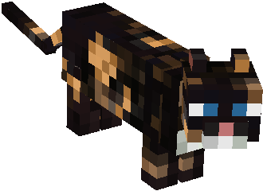

  <!-- Logo and Title -->
  
  <h1>Cat Pack</h1>
  
A collection of textures I like.

  <!-- Fancy badges -->

  

  <h2>Table of Contents</h2>
  <a href="#About">About</a>
   | 
  <a href="#Installation">Installation</a>
   | 
  <a href="#Showcase">Showcase</a>
   | 
  <a href="#Credits">Credits</a>

  

  ## About

  Cat Pack is a collection of textures I like. Most of these textures were not created by me. This is a small side project, and it probably wont be updated very often. Feel 
  free to open pull requests with suggestions or changes.

  

  ## Installation

  - Download the latest [release](/../../releases)
  - Place the zip file in your `.minecraft/resourcepacks` folder
    - If you don't have a resourcepacks folder, create one
  - Open Minecraft and select the pack in the resource pack menu
  - Enjoy!

   

  *Note: I recommend you download [fabric sky boxes](https://modrinth.com/mod/fabricskyboxes)*

  

  

  ## Showcase

  

  

  

  

  

  

  

  

  

  

  ## Credits

  - Created by: cqb13
  - GUI based on UWU GUI by: bergysha
  - Apple Skin Textures by: wornscarf
  - Netherite gear by: toxteer
  - full blocks: vanilla tweaks
  - redstone level json file: vanilla tweaks
  - dye: vanilla tweaks
  - bricks and bookshelf: vanilla tweaks
  - Sky: UsernameGeri

   
*Note: Most of these are not mine*

